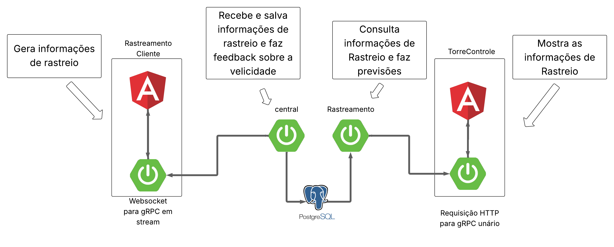

# Projeto de Rastreamento de Veículos

## Diagrama de Estrutura



---

## Estrutura das Pastas

```
.
├── Diagrama.png
├── docker-compose.yml
├── central/ 
├── postgres-data/
├── Rastreamento/
├── RastreamentoCliente/
├── TorreControle/
├── websocket-to-grpc/
├── web_to_grpc_unario/
```

Cada pasta representa um componente do diagrama acima.

---

## Tecnologias Utilizadas

- **Java 21** (todos os serviços backend)
- **Angular 19.2.0** (frontends)
- **Docker 26.1.3** (orquestração dos containers)
- **PostgreSQL 17.5** (armazenamento de dados, via volume `postgres-data`)
- **gRPC** (comunicação entre serviços)
- **WebSocket** (camada de conversão para streaming com front Angular)

---

## Comunicação entre Serviços

- **RastreamentoCliente** (Angular) envia dados via WebSocket para o serviço **websocket-to-grpc**.
- **websocket-to-grpc** converte WebSocket em gRPC streaming e comunica com o serviço **central**.
- **central** recebe dados dos veículos, salva no banco (PostgreSQL) e devolve feedback sobre a velocidade.
- **TorreControle** (Angular) faz requisições HTTP para **web_to_grpc_unario**.
- **web_to_grpc_unario** converte HTTP em gRPC unário e consulta o serviço **Rastreamento**.
- **Rastreamento** consulta o banco e retorna previsões e informações dos veículos para o **TorreControle**.
- O volume **postgres-data** é compartilhado entre os serviços Java para persistência dos dados.

---

## Como Executar

1. Crie a pasta `postgres-data` na raiz do projeto:
   ```sh
   mkdir postgres-data
   ```
2. Crie um arquivo `.env` conforme o exemplo em `.env.example`, preenchendo com o seu IP local.
3. Execute o projeto com Docker Compose:
   ```sh
   docker compose up --build
   ```
4. Para começar a gerar dados de um veiculo entre no seu navegador no ip que colocou no .env e a porta 4200 ex:
    ```
    http://192.168.0.9:4200
    ```
5. Para visualizar os dados gerados entre no navegador com o ip que colocou no .env e a porta 4269 ex:
    ```
    http://192.168.0.9:4269
    ```

6. Clique em algum local da pagina no site com a porta 4269 para começar a pegar informações dos carros.
---

## Justificativa da Arquitetura

- **Java** foi escolhido por ser compatível com gRPC, mas descobri que não suporta gRPC-Web nativamente, o que exigiu a criação de camadas de conversão (websocket-to-grpc e web_to_grpc_unario).
- A arquitetura ficou mais complexa do que o necessário, mas foi interessante explorar a integração de diferentes padrões de comunicação.
- Não foi utilizado GO para evitar curva de aprendizado adicional, embora eu tenha visto que GO é compativel gom gRPC-Web nativo depois de ter feito metade do projeto.
- O uso de streaming gRPC foi mantido para garantir comunicação em tempo real, mesmo com as limitações do gRPC-Web.

---
